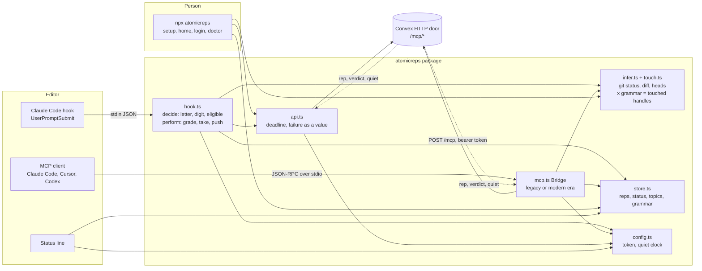

# atomicreps

One short retrieval question about the thing you just built, inside Claude Code, Cursor, Codex or any MCP client.

```
npx atomicreps            the terminal surface: you, this session, topics, mutes, rate
npx atomicreps setup      first-run wizard: areas, topics, how often, how hard
npx atomicreps login      sign in from a browser with a typed code
npx atomicreps connect    register the server with your editor
npx atomicreps mcp        the stdio bridge (what the editor launches)
npx atomicreps doctor     token, server ping, grammar, quiet clock, allowlist
npx atomicreps logout     forget the token on this machine
```

Add `--alpha` to any command to use the staging door. It keeps its own token and
cache, so both can be signed in at once.

## How it behaves

When the agent finishes a task it calls `rep` once with a few words for what
changed. The server ranks what the session touched, prefers the areas you chose,
and answers with one question or with nothing. The agent reproduces the block;
you reply with a letter, or ignore it.

Under the verdict, one line names up to three other things the session touched. A
number asks for one. "Never Swift" mutes a topic for good, "not this topic" rests
it for thirty days, "unmute Swift" lifts it. "How am I doing" prints your summary.

The server enforces the manners, not the agent: a minimum gap between pushed
reps, a daily cap, mute and off, a refusal for an answer typed within seconds of
the serve, and no answer key in any rep payload. Two ignored reps quiet the door
for the day. Every failure answers quiet rather than an error; `doctor` says why.

## How it fits together



Three entry points, one wire. The hook and the bridge both infer what the session
touched locally, send only handle names and small weights, and note what came
back so the status line and the next prompt can read it from disk.

## Tools

| tool | what it does |
| --- | --- |
| `rep({ touched?, ask?, topic?, kind?, exclude? })` | one question, one insight, or quiet; `ask` takes a handle from an offer |
| `answer({ pick, id? })` | the verdict, the why, and the offer line |
| `me({ show? })` | `summary`, `skills`, `reps`, `streak` or `mutes` |
| `settings({ intensity?, topics?, levels?, prefer?, mute?, muteMinutes?, days?, unmute?, dialog? })` | the rate, the pinned topics, the difficulty band, the preferred areas, mutes, the dialog |

Handles are `topic` or `topic.subskill` (`react.hooks_core`). Fifty sub-skill
slugs repeat across topics, so the topic is always part of the name.

`settings({ dialog: true })` asks for the letter in the host's native dialog
instead of the chat. It blocks the turn while open, so it is a setting, never the
default.

## The wire

`npx atomicreps mcp` is a bridge, not a second server: every JSON-RPC message
from the editor is forwarded to the door with your token, and the answer comes
back. The door speaks the 2026-07-28 revision (stateless, `server/discover`,
mirrored headers) and the older `initialize` handshake for clients still on it.

What leaves your machine on a `rep` call: the agent's words, package names from
the manifest, the file extensions and top-level folder names you touched, and
catalog handles with small weights. Never your code, never a file's contents,
never a prompt. `npx atomicreps setup` prints the exact payload for the repo you
are standing in, before you sign in.

The table that maps paths and diff words to handles is published by the server
and cached for a month.

## Login

`npx atomicreps` prints a code. You type it at atomicreps.com/connect while
signed in, so a forwarded link approves nothing. The token lands in
`~/.config/atomicreps/config.json` (mode 0600), prefixed `arep_` so secret
scanners find it, and can be revoked on your account page.

## Development

```
pnpm install --ignore-workspace
pnpm build     # dist/cli.js, one file, no runtime dependencies
pnpm test
ATOMICREPS_API=https://<deployment>.convex.site node dist/cli.js doctor
```

MIT.
